# How Claude Creates a PowerPoint for You — Explained Simply

Welcome! This guide will teach you how an AI-powered system creates a PowerPoint presentation. Don't worry if you're not technical — we'll use everyday analogies and visual diagrams to make everything crystal clear.

## Table of Contents
1. [The Big Picture: What We're Building](#the-big-picture)
2. [Understanding the Players (Components)](#understanding-the-players)
3. [The Journey of Your Request](#the-journey)
4. [Real-World Example Walkthrough](#example-walkthrough)
5. [Key Takeaways](#key-takeaways)

---

## The Big Picture: What We're Building {#the-big-picture}

Imagine you're at a restaurant. You tell the waiter, "I'd like a pizza with mushrooms and olives." The waiter doesn't make the pizza themselves — they:
1. Write down your order
2. Take it to the kitchen
3. The chef makes your pizza
4. The waiter brings it back to you

**Creating a PowerPoint with AI works the same way!**

You say: "Create a 5-slide PowerPoint about the history of AI"
- The system takes your request
- Sends it to Claude (the AI "chef")
- Claude creates the content
- The system packages it and gives you a download link

Let's break this down step by step.

---

## Understanding the Players (Components) {#understanding-the-players}

Think of this as a team of people working together. Each person has a specific job:

### 1. **You (The User)**
- You're the person who wants a PowerPoint presentation
- You type your request: "Make me a presentation about AI history"

### 2. **The Frontend (The Receptionist)**
- This is the website or app you see on your screen
- Like a receptionist, it takes your request and passes it along
- It also shows you the final result

### 3. **The Router (The Manager)**
- This is like a restaurant manager who decides which chef handles which order
- It reads your request and thinks: "This is about creating a PowerPoint, so I'll send it to the PowerPoint specialist"
- It makes sure your request goes to the right place

### 4. **Claude PowerPoint Handler (The Specialist Chef)**
- This is a specialized system that knows how to work with Claude specifically for PowerPoint creation
- It prepares everything Claude needs to understand your request
- It packages Claude's response properly

### 5. **Claude Model (The Master Chef)**
- This is the AI brain — Claude
- It reads your request and creates the actual content: titles, bullet points, speaker notes
- It's incredibly smart but needs specific instructions to work well

### 6. **PowerPoint Generator Tool (The Packaging Department)**
- Claude creates the IDEAS for your presentation (the text content)
- This tool takes those ideas and creates the actual `.pptx` file
- Like a packaging department turning a recipe into a boxed meal

### 7. **Storage (The Warehouse)**
- Once your PowerPoint file is created, it needs to be stored somewhere
- This is like a warehouse that holds your file
- It gives you a link so you can download it anytime

Here's a simple diagram showing how these players connect:

```mermaid
graph TD
    User[👤 You<br/>The User]
    Frontend[💻 Frontend<br/>The Receptionist]
    Router[🎯 Router<br/>The Manager]
    Handler[🔧 PowerPoint Handler<br/>The Specialist Chef]
    Claude[🤖 Claude<br/>The Master Chef]
    Generator[📦 PPT Generator<br/>Packaging Department]
    Storage[🗄️ Storage<br/>The Warehouse]
    
    User -->|"I want a presentation"| Frontend
    Frontend -->|Passes request| Router
    Router -->|Routes to specialist| Handler
    Handler -->|Prepares & sends request| Claude
    Claude -->|Creates content| Handler
    Handler -->|Content to convert| Generator
    Generator -->|Saves file| Storage
    Storage -->|Download link| Frontend
    Frontend -->|"Here's your file!"| User
    
    style User fill:#e1f5ff
    style Frontend fill:#fff4e1
    style Router fill:#ffe1f5
    style Handler fill:#f5e1ff
    style Claude fill:#e1ffe1
    style Generator fill:#ffe1e1
    style Storage fill:#f0f0f0
```



---

## The Journey of Your Request {#the-journey}

Let's follow your request step by step, like tracking a package through delivery.

### Step 1: You Make a Request
**You type:** "Create a 5-slide PowerPoint about the history of AI with speaker notes"

**Think of it like:** Placing an order at a restaurant

### Step 2: Frontend Receives It
The website you're using captures everything you typed and packages it nicely.

**What gets packaged:**
- Your exact request (the text you typed)
- Your preferences (5 slides, speaker notes needed)
- Your session ID (so the system knows it's you)

**Think of it like:** The waiter writing down your order with all the details

### Step 3: Router Decides Where to Send It
The router is smart! It reads your request and recognizes keywords:
- "PowerPoint" ✓
- "slides" ✓
- "create" ✓

It thinks: "This is definitely a PowerPoint generation request. I'll send it to the PowerPoint specialist."

**Think of it like:** A restaurant manager reading the order and saying, "This goes to the pizza chef, not the sushi chef"

### Step 4: PowerPoint Handler Prepares Everything
The handler knows that Claude needs very specific instructions to work well. So it:

1. **Adds context:** "You are a PowerPoint expert. Create structured, professional slide content."
2. **Adds examples:** Shows Claude examples of good slide structures
3. **Adds constraints:** "Create exactly 5 slides. Include speaker notes for each."
4. **Formats properly:** Makes sure everything is in the right format for Claude

**Think of it like:** A sous chef preparing all ingredients and setting up the station before the master chef starts cooking

### Step 5: Claude Creates the Content
Claude receives the well-prepared request and creates:

```
Slide 1: Title Slide
Title: "The History of Artificial Intelligence"
Subtitle: "From Dreams to Reality"

Slide 2: The Early Days (1950s-1960s)
- Alan Turing proposes the "Turing Test" (1950)
- First AI programs: Logic Theorist (1956)
- Term "Artificial Intelligence" coined at Dartmouth Conference
Speaker Notes: The field of AI began with ambitious goals...

[... and so on for all 5 slides]
```

**Think of it like:** The chef cooking your meal following the recipe and specifications

### Step 6: Converting to Actual PowerPoint File
Claude created the TEXT content (titles, bullet points, notes), but we need an actual `.pptx` file that PowerPoint can open.

The PowerPoint Generator Tool:
- Takes Claude's text
- Creates slides
- Formats them nicely
- Adds professional styling
- Saves it as `presentation.pptx`

**Think of it like:** Taking a recipe card and actually putting the food on a nice plate

### Step 7: Storing the File
The file is saved in Storage with:
- A unique ID
- Your session information
- A shareable link

**Think of it like:** Putting your takeout order in a bag with your order number

### Step 8: Sending It Back to You
The system sends the download link back through:
- Storage → Handler → Router → Frontend → YOU

You see on your screen: "✓ Your PowerPoint is ready! [Download]"

**Think of it like:** The waiter bringing your pizza to your table

Here's a visual timeline of this journey:

```mermaid
graph LR
    A[🎯 Step 1<br/>You Request] --> B[📝 Step 2<br/>Frontend<br/>Captures]
    B --> C[🎯 Step 3<br/>Router<br/>Decides]
    C --> D[🔧 Step 4<br/>Handler<br/>Prepares]
    D --> E[🤖 Step 5<br/>Claude<br/>Creates]
    E --> F[📦 Step 6<br/>Generator<br/>Builds File]
    F --> G[🗄️ Step 7<br/>Storage<br/>Saves]
    G --> H[✅ Step 8<br/>You<br/>Download]
    
    style A fill:#e1f5ff
    style B fill:#e8f5e1
    style C fill:#fff4e1
    style D fill:#f5e1ff
    style E fill:#e1ffe1
    style F fill:#ffe1e1
    style G fill:#f0f0f0
    style H fill:#e1f5ff
```



---

## Real-World Example Walkthrough {#example-walkthrough}

Let's put it all together with a complete, detailed example.

### The Scenario

**You:** "I need to give a presentation tomorrow about AI history to my class. I need 5 slides with speaker notes so I know what to say."

**You type into the system:** "Create a 5-slide PowerPoint about the history of AI with speaker notes and a title slide"

### The Complete Journey (With All the Details)

The diagram below shows every step of the process. Read from top to bottom — each arrow represents communication between the different parts of the system:

```mermaid
sequenceDiagram
    participant User as 👤 You
    participant Frontend as 💻 Website
    participant Router as 🎯 Router
    participant Handler as 🔧 PowerPoint<br/>Specialist
    participant Claude as 🤖 Claude AI
    participant Generator as 📦 File<br/>Generator
    participant Storage as 🗄️ Storage

    User->>Frontend: "Create a 5-slide PowerPoint<br/>about the history of AI with<br/>speaker notes and a title slide"
    
    Note over Frontend: Website receives your<br/>request and packages it
    
    Frontend->>Router: Here's a request:<br/>- Text: "Create a 5-slide PowerPoint..."<br/>- User: ID #12345<br/>- Preferences: speaker notes needed
    
    Note over Router: Router analyzes the request:<br/>🔍 Found keywords: "PowerPoint", "slides", "create"<br/>✅ This is a PowerPoint request!
    
    Router->>Handler: Send to PowerPoint specialist
    
    Note over Handler: Handler prepares the request<br/>for Claude with special instructions
    
    Handler->>Claude: 🎯 TASK: You are a PowerPoint expert<br/><br/>📋 CREATE: 5 slides about AI history<br/><br/>✅ INCLUDE:<br/>- Title slide<br/>- Historical content<br/>- Speaker notes for each slide<br/><br/>📝 FORMAT: Structured text output
    
    Note over Claude: Claude processes the request<br/>and creates content...<br/><br/>⏱️ This takes 3-5 seconds
    
    Claude-->>Handler: ✅ CONTENT CREATED:<br/><br/>Slide 1: [Title Slide]<br/>Title: "The History of AI"<br/>Subtitle: "From Theory to Reality"<br/>Speaker Notes: "Welcome everyone..."<br/><br/>Slide 2: [Early Days 1950s-1960s]<br/>• Alan Turing & the Turing Test<br/>• First AI programs...<br/>[... continues for all 5 slides]
    
    Note over Handler: Handler receives content<br/>✅ Looks good!<br/>Sending to file generator...
    
    Handler->>Generator: Please convert this text<br/>into a .pptx file:<br/>[sends all the content]
    
    Note over Generator: Generator creates the file:<br/>📄 Creating slides<br/>🎨 Applying professional theme<br/>📝 Adding speaker notes<br/>💾 Saving as .pptx
    
    Generator-->>Handler: ✅ File created!<br/>File: presentation_ai_history.pptx<br/>Size: 2.3 MB
    
    Handler->>Storage: Please save this file
    
    Note over Storage: Storage saves the file<br/>and creates a download link
    
    Storage-->>Handler: ✅ Saved!<br/>Link: https://storage.example.com/files/abc123
    
    Handler-->>Router: ✅ Success!<br/>Download link: [link]<br/>Preview: [thumbnail]
    
    Router-->>Frontend: ✅ Request complete!<br/>Sending result to user...
    
    Frontend-->>User: ✅ Your PowerPoint is ready!<br/><br/>[Preview image]<br/><br/>📥 [Download Button]<br/><br/>📊 5 slides created<br/>📝 Speaker notes included<br/>⏱️ Created in 8 seconds
    
    Note over User: You click download<br/>and get your file! 🎉
```



**Breaking down what you see in the diagram:**
- **Solid arrows (→)** = Someone asks for something or sends information
- **Dashed arrows (- -)** = Someone responds or sends back a result  
- **Yellow boxes** = Explanations of what's happening at that moment
- **Time flows from top to bottom** = What happens first is at the top

### What If Something Goes Wrong?

Systems aren't perfect! Let's see what happens when there's a problem:

```mermaid
sequenceDiagram
    participant User as 👤 You
    participant Frontend as 💻 Website
    participant Handler as 🔧 Handler
    participant Claude as 🤖 Claude
    participant Generator as 📦 Generator

    User->>Frontend: "Create PowerPoint about AI"
    Frontend->>Handler: Process this request
    Handler->>Claude: Create content
    Claude-->>Handler: ✅ Here's the content
    
    Handler->>Generator: Convert to .pptx
    
    Note over Generator: ❌ ERROR!<br/>Generator service is down
    
    Generator-->>Handler: ❌ Error: Cannot create file<br/>Reason: Service unavailable
    
    Note over Handler: Handler catches the error<br/>and sends a friendly message
    
    Handler-->>Frontend: ❌ Error occurred<br/>Message: "Sorry, we couldn't<br/>create your file right now"
    
    Frontend-->>User: ⚠️ Oops! Something went wrong.<br/><br/>We couldn't create your PowerPoint<br/>right now. Please try again in a<br/>few minutes.<br/><br/>[Try Again Button]
```



**Why this is good design:**
- You don't see confusing technical errors
- You get a friendly, clear message
- You know what to do next (try again later)
- The system doesn't crash — it handles problems gracefully

### What If Claude Needs More Information?

Sometimes Claude might need clarification to give you the best result:

```mermaid
sequenceDiagram
    participant User as 👤 You
    participant System as 💻 System
    participant Claude as 🤖 Claude

    User->>System: "Create a presentation about AI"
    System->>Claude: Create PowerPoint about AI
    
    Note over Claude: Claude thinks:<br/>"This is vague. What kind of AI?<br/>How many slides? What audience?"
    
    Claude-->>System: ❓ I need more information:<br/>- What aspect of AI? (history, future, applications?)<br/>- How many slides do you want?<br/>- Who is the audience?
    
    System-->>User: 🤔 To create the best presentation,<br/>I need some more details:<br/><br/>1️⃣ What aspect of AI interests you?<br/>   □ History   □ Future   □ Applications<br/><br/>2️⃣ How many slides? [___]<br/><br/>3️⃣ Who's the audience?<br/>   □ Students   □ Professionals   □ General
    
    User->>System: - History ✓<br/>- 5 slides<br/>- Students ✓
    
    System->>Claude: Now with more details:<br/>"Create 5 slides about AI history<br/>for a student audience"
    
    Note over Claude: Perfect! Now I have<br/>everything I need
    
    Claude-->>System: ✅ Here's your content!
    
    System-->>User: ✅ Your PowerPoint is ready!
```



**This is smart design because:**
- The system asks for what it needs instead of guessing
- You provide clear, specific answers
- The final result is exactly what you want
- No time is wasted creating the wrong thing

---

## Key Takeaways {#key-takeaways}

### What You Learned

✅ **The Big Picture:** Creating a PowerPoint with AI is like ordering food at a restaurant — your request goes through several specialists before you get the final product

✅ **The Players:** Each component (Frontend, Router, Handler, Claude, Generator, Storage) has a specific job, like members of a team

✅ **The Journey:** Your request travels through 8 steps, getting refined and processed at each stage:
1. You make a request
2. Frontend captures it
3. Router decides where to send it
4. Handler prepares it for Claude
5. Claude creates the content
6. Generator builds the actual file
7. Storage saves it
8. You download it!

✅ **Error Handling:** Good systems handle problems gracefully and give you friendly, helpful messages instead of confusing technical errors

✅ **Smart Interactions:** Sometimes the system asks for clarification to give you better results — this shows intelligent design

### Why This Matters

Understanding how AI systems work helps you:

1. **Use them better** — You know what information to provide and how to phrase your requests for the best results

2. **Understand limitations** — You know what can go wrong and why, so you're not frustrated when issues occur

3. **Appreciate the complexity** — Many sophisticated steps happen behind the scenes in just a few seconds to make the experience feel simple and magical

4. **Set realistic expectations** — You understand that the system needs clear instructions and sometimes clarification to give you what you want

5. **Build your own** — If you ever want to create similar AI-powered systems, you now understand the basic architecture and how the pieces fit together

---

## The Bottom Line

Creating a PowerPoint with AI involves a carefully choreographed dance between multiple specialized components, each doing its part perfectly:

- **You** provide the creative request
- **The Frontend** welcomes and captures your needs  
- **The Router** makes smart decisions about where to send your request
- **The Handler** prepares everything perfectly for Claude
- **Claude** uses its AI intelligence to create amazing content
- **The Generator** turns that content into a real, usable file
- **The Storage** keeps it safe and gives you a download link

All of this happens in seconds, making the complex feel effortless!

The magic isn't that one super-smart component does everything — it's that many specialized components work together seamlessly, each focused on doing one thing really well.

---

*Now you understand the "behind the scenes" of AI-powered PowerPoint creation! This same pattern (Frontend → Router → Specialist Handler → AI → Tool → Storage → User) is used in many AI applications, from document generation to image creation to code writing.*
