# Understanding Claude Skills 

Welcome! This guide will teach you what Claude Skills are and how every piece of this project works. We'll use simple examples and stories so anyone can understand!

## Table of Contents
1. [What is a Claude Skill?](#what-is-skill)
2. [The Magic Recipe Book (SKILL.md)](#skill-md)
3. [The Kitchen Tools (scripts/ folder)](#scripts-folder)
4. [The Recipe Cards (templates/ folder)](#templates-folder)
5. [The Finished Dishes (examples/ folder)](#examples-folder)
6. [The Cookbook (references/ folder)](#references-folder)
7. [How Everything Works Together](#how-it-works)
8. [Try It Yourself](#try-it-yourself)

---

## 🎯 Quick Overview: What You Get

This Claude Skill includes **5 comprehensive calculator templates**, each production-ready:

| Template | Purpose | Key Features |
|----------|---------|--------------|
| 📊 **Basic** | Simple arithmetic | Add, subtract, multiply, divide |
| 📈 **Percentage** | Percentage calculations | Find percentages, percentage change |
| 💰 **Financial** | Money calculations | Loans, investments, savings, tips |
| 🔄 **Converter** | Unit conversions | Length, weight, temperature, volume |
| 💪 **Health** | Health metrics | BMI, BMR, body fat, water intake |

**Each template features:** Beautiful design • Input validation • Educational comments • Responsive layout • Professional polish

---

## What is a Claude Skill? {#what-is-skill}

### The Simple Answer

Imagine you have a really smart friend named Claude who can help you with many things. But sometimes, you want Claude to be EXTRA good at one specific thing — like making calculators!

**A Claude Skill is like giving Claude a specialized instruction manual** that makes Claude an expert at that one specific task.

### The Restaurant Analogy

Think of Claude as a talented chef who can cook many different foods. A Claude Skill is like:

```mermaid
graph TD
    A[👨‍🍳 Claude<br/>The Chef] -->|Without Skill| B[Can cook<br/>basic meals]
    A -->|With Calculator Skill| C[Calculator Expert!<br/>Perfect calculators<br/>every time]

    B --> D[Makes okay calculators<br/>might forget things]
    C --> E[Follows best practices<br/>Uses templates<br/>Adds Python power]

    style A fill:#0d47a1
    style C fill:#1b5e20
    style E fill:#263238
```



**Without a skill:** Claude can make calculators, but might do it differently each time

**With a skill:** Claude follows the same proven recipe every time, making perfect calculators!

---

## The Magic Recipe Book (SKILL.md) {#skill-md}

### What is SKILL.md?

The `SKILL.md` file is the **master instruction manual** for Claude. It's like the recipe book that tells the chef exactly how to make each dish.

### What's Inside?

Think of SKILL.md as a textbook divided into chapters:


### Breaking It Down: The Sections

#### 1. **What This Skill Does** 📚
**Like:** The introduction to a cookbook that explains what kind of food you'll learn to make

**Contains:**
- "This skill helps Claude create simple, interactive calculators"
- "It shows structured guidance, templates, and best practices"

**Why it matters:** Claude reads this first to understand the purpose

---

#### 2. **Calculator Creation Workflow** 🛠️

This section is like a **step-by-step cooking recipe**:

**Step 1: Identify Calculator Type**
```
User: "I need a tip calculator"
Claude thinks: "Okay, that's a financial calculator type"
```

**Step 2: Use the Appropriate Template**
```
Claude looks in /templates/ folder
Finds: financial-calculator.html (has loan, investment, savings, and tip calculators)
Focuses on: The tip calculator section
```

**Step 3: Customize the Template**
```
Claude modifies it:
- Changes title to "Tip Calculator"
- Adjusts for bill amount and tip percentage
- Updates the calculation logic
```

**Step 4: Add Educational Comments**
```javascript
// This function calculates the tip amount
function calculateTip(billAmount, tipPercent) {
    // Convert percentage to decimal (15% = 0.15)
    const tipDecimal = tipPercent / 100;
    // Multiply bill by tip percentage
    return billAmount * tipDecimal;
}
```

**Step 5: Test and Deliver**
```
Claude creates the final calculator and explains how to use it
```

---

#### 3. **Best Practices** 💡

This section is like **cooking tips from a master chef**:


**Example from the skill:**
```javascript
// GOOD: Clear variable names and comments
function calculateBMI(weightKg, heightM) {
    // BMI = weight in kg / (height in meters)²
    const bmi = weightKg / (heightM * heightM);
    return bmi.toFixed(1); // Round to 1 decimal place
}

// BAD: Unclear code
function calc(w, h) {
    return w/(h*h);
}
```

---

#### 4. **Python Script Information** 🐍

This tells Claude about the special Python powers available:

**Think of it like:** The chef discovering they have a professional mixer, food processor, and other advanced tools!

```
Regular tools (JavaScript): Good for simple calculators
Power tools (Python): Can do complex math, create multiple files, analyze data
```

---

### How Claude Reads SKILL.md

When you ask Claude to create a calculator:


---

## The Kitchen Tools (scripts/ folder) {#scripts-folder}

The `scripts/` folder contains **Python programs** that give Claude superpowers! Let's look at each tool.

### Overview: The Three Tools


---

### Tool #1: calculator_engine.py — The Calculator Brain 🧠

**What it does:** Performs complex calculations that would be hard to do in a web browser

**Think of it as:** A scientific calculator that can do thousands of calculations per second

#### Capabilities:

**1. Basic Math** ➕➖✖️➗
```python
# Simple example
calc.basic_operation(10, 5, "multiply")
# Result: 50
```

**2. Scientific Functions** 🔬
```python
# Calculate sine, cosine, square root, etc.
calc.scientific_calculation(45, "sin")
# Result: 0.7071 (sine of 45 degrees)
```

**3. Financial Calculations** 💰
```python
# Calculate loan payments
calc.loan_payment(
    principal=200000,    # $200,000 loan
    annual_rate=4.5,     # 4.5% interest
    years=30             # 30 year loan
)
# Result: Monthly payment = $1,013.37
```

**4. Statistical Analysis** 📊
```python
# Analyze a dataset
data = [23, 45, 67, 89, 12, 34, 56, 78, 90, 45]
calc.statistics(data)
# Result: Mean=53.9, Median=50.5, Std Dev=26.8
```

#### How Claude Uses It:


#### Real Code Example:

```python
def loan_payment(self, principal: float, annual_rate: float, 
                years: int) -> CalculationResult:
    """
    Calculate monthly loan payment
    """
    # Convert to monthly values
    monthly_rate = annual_rate / 100 / 12
    num_payments = years * 12
    
    # Calculate payment using the formula
    payment = principal * (monthly_rate * (1 + monthly_rate)**num_payments) / \
             ((1 + monthly_rate)**num_payments - 1)
    
    total_paid = payment * num_payments
    total_interest = total_paid - principal
    
    return {
        "monthly_payment": round(payment, 2),
        "total_paid": round(total_paid, 2),
        "total_interest": round(total_interest, 2)
    }
```

**Why this is amazing:** Claude can do in 1 second what would take minutes with a regular calculator!

---

### Tool #2: generate_calculator.py — The Factory 🏭

**What it does:** Creates complete calculator HTML files automatically

**Think of it as:** A factory that can build custom calculators based on your specifications

#### What It Can Build:

```mermaid
graph TD
    A[🏭 generate_calculator.py] --> B[Basic Calculators]
    A --> C[Specialized Calculators]
    
    B --> B1[Custom operations]
    B --> B2[Color themes]
    B --> B3[Any combination]
    
    C --> C1[Financial: Loan, Investment, Savings, Tip]
    C --> C2[Health: BMI, BMR, Body Fat, Water]
    C --> C3[Converter: Length, Weight, Temp, Volume]
    C --> C4[Percentage: All types]
    
    style A fill:#ffb74d,color:#000000
    style B fill:#64b5f6,color:#000000
    style C fill:#ab47bc
```



#### Example: Building a Custom Calculator

**You tell Claude:** "Create a blue calculator that can add, multiply, and calculate powers"

**What happens behind the scenes:**

```python
# Claude calls the generator
generator = CalculatorGenerator()

html = generator.generate_basic_calculator(
    title="My Custom Calculator",
    operations=["add", "multiply", "power"],
    color_scheme="blue"
)

# Save the file
generator.save_calculator(html, "my_calculator.html")
```

**Result:** A complete, working HTML file is created in seconds!

#### The Magic Inside:

The generator has **templates built into the code** that it fills in with your specifications:

```python
def generate_basic_calculator(self, title, operations, color_scheme):
    # Starts with base HTML template
    html = """
    <!DOCTYPE html>
    <html>
    <head>
        <title>{TITLE_GOES_HERE}</title>
        <style>{COLORS_GO_HERE}</style>
    </head>
    <body>
        {CALCULATOR_GOES_HERE}
        {BUTTONS_GO_HERE}
    </body>
    </html>
    """
    
    # Fills in the blanks with your specifications
    # Returns complete, working HTML
    return html
```

**It's like Mad Libs, but for code!**

---

### Tool #3: demo.py — The Teacher 👨‍🏫

**What it does:** Demonstrates how everything works and teaches you about the skill

**Think of it as:** An interactive tutorial that shows you all the features

#### What the Teacher Can Show You:

**1. Skill Structure** 📁
```
Shows you how the folders are organized
Explains what each file does
```

**2. Live Calculations** 🧮
```
Runs real calculations
Shows you the results
Explains the formulas
```

**3. HTML Generation** 🏭
```
Creates calculator files
Shows you where they're saved
Lets you see them work
```

**4. How Claude Uses the Skill** 🎓
```
Explains the workflow
Shows the decision process
Demystifies the "magic"
```

#### Interactive Menu:

When you run `python scripts/demo.py`, you see:

```
============================================================
 CLAUDE SKILL DEMONSTRATION
============================================================

📚 Choose a demonstration:

1. Show Skill Structure
2. Demonstrate Calculations
3. Generate Calculators
4. Explain How It Works
5. Show Benefits
6. Run Everything
0. Exit

Select option (0-6):
```

**It's like a museum tour guide showing you everything!**

---

### How the Three Tools Work Together:

```mermaid
graph TB
    User[👤 You] -->|asks for| Claude[🤖 Claude]
    
    Claude -->|simple math| Browser[🌐 JavaScript<br/>in Browser]
    Claude -->|complex math| Engine[🧠 calculator_engine.py]
    Claude -->|generate files| Generator[🏭 generate_calculator.py]
    Claude -->|learn/demo| Demo[👨‍🏫 demo.py]
    
    Browser --> Result1[Basic calculator]
    Engine --> Result2[Complex calculation]
    Generator --> Result3[Custom HTML file]
    Demo --> Result4[Educational output]
    
    style User fill:#64b5f6
    style Claude fill:#66bb6a
    style Engine fill:#ffb74d
    style Generator fill:#ef9a9a
    style Demo fill:#ab47bc
```



---

## The Recipe Cards (templates/ folder) {#templates-folder}

### What are Templates?

**Templates are pre-made calculator designs** that Claude can customize for your needs.

**Think of them as:** Cookie cutter shapes — you have the basic shape, then you decorate it however you want!

### The Five Templates:

```mermaid
graph TB
    A[📁 templates/] --> B[basic-calculator.html<br/>Simple 4-function calculator]
    A --> C[percentage-calculator.html<br/>Percentage calculations]
    A --> D[financial-calculator.html<br/>Money calculations]
    A --> E[converter-calculator.html<br/>Unit conversions]
    A --> F[health-calculator.html<br/>Health metrics]
    
    B --> B1[➕ Addition<br/>➖ Subtraction<br/>✖️ Multiplication<br/>➗ Division]
    
    C --> C1[Find X% of Y<br/>What % is X of Y?<br/>Percentage change]
    
    D --> D1[Loan payments<br/>Investment growth<br/>Savings goals<br/>Tip calculator]
    
    E --> E1[Length, Weight<br/>Temperature<br/>Volume]
    
    F --> F1[BMI, BMR<br/>Ideal Weight<br/>Body Fat<br/>Water Intake]
    
    style A fill:#ffb74d
    style B fill:#64b5f6
    style C fill:#66bb6a
    style D fill:#0f9b0f
    style E fill:#6366f1
    style F fill:#14b8a6
```



### Template Details:

Each template is a complete, production-ready calculator:

**1. basic-calculator.html** 📊
- Four basic operations: add, subtract, multiply, divide
- Perfect for simple arithmetic needs
- Clean, minimal interface

**2. percentage-calculator.html** 📈
- Calculate X% of Y
- Find what % X is of Y
- Calculate percentage change (increase/decrease)
- Great for business and shopping calculations

**3. financial-calculator.html** 💰
- **Loan Calculator**: Monthly payments, total interest
- **Investment Calculator**: Compound interest with contributions
- **Savings Goal**: Required monthly savings
- **Tip Calculator**: Bill splitting functionality
- Uses real financial formulas (amortization, compound interest)

**4. converter-calculator.html** 🔄
- **Length**: meters, feet, miles, inches, etc.
- **Weight**: kg, lbs, ounces, tons
- **Temperature**: Celsius, Fahrenheit, Kelvin
- **Volume**: liters, gallons, cups, fluid ounces
- Swap button for quick conversion reversal

**5. health-calculator.html** 💪
- **BMI**: Body Mass Index with category indicators
- **BMR**: Basal Metabolic Rate (Mifflin-St Jeor equation)
- **Ideal Weight**: Using Devine formula
- **Body Fat**: US Navy method (with gender-specific calculations)
- **Water Intake**: Daily hydration recommendations
- Includes medical disclaimer

### How Templates Work:

#### Before (Template):
```html
<h1>Calculator</h1>
<input id="num1" placeholder="First number">
<input id="num2" placeholder="Second number">
<button onclick="calculate()">Calculate</button>
```

#### After Claude Customizes:
```html
<h1>🍕 Pizza Tip Calculator</h1>
<input id="num1" placeholder="Bill amount ($)">
<input id="num2" placeholder="Tip percentage (%)">
<button onclick="calculate()">Calculate Tip 💰</button>
```

**Same structure, different content!**

### Common Features Across All Templates:

Every template includes these professional features:

✨ **Beautiful Design**
- Unique gradient backgrounds (each template has its own color scheme)
- Modern, clean interface with rounded corners
- Smooth animations and transitions
- Fully responsive (works on phones, tablets, computers)

🛡️ **Robust Functionality**
- Input validation (checks for valid numbers)
- Error handling (helpful error messages)
- Clear labels and instructions
- Result formatting (proper decimal places, units)

📚 **Educational Elements**
- Code comments explaining how everything works
- Information boxes explaining formulas and concepts
- Educational tooltips and guidance
- "How it works" sections

👤 **Professional Polish**
- Developer credit section (customizable)
- Consistent styling and branding
- Print-friendly layouts
- Accessibility considerations

### Why Templates Are Awesome:

```mermaid
graph TD
    A[🎯 Benefits of Templates] --> B[⚡ Speed<br/>Don't start from scratch]
    A --> C[✅ Quality<br/>Proven to work well]
    A --> D[🎨 Consistency<br/>Same professional look]
    A --> E[🔧 Customizable<br/>Easy to modify]
    
    style A fill:#66bb6a
```



**It's like having a coloring book** — the outline is done, you just add the colors and details!

---

## The Finished Dishes (examples/ folder) {#examples-folder}

### What are Examples?

**Examples are complete, working calculators** that show what's possible.

**Think of them as:** The display case at a bakery showing finished cakes, so you know what you can order!

### The Examples:

```mermaid
graph TB
    A[📁 examples/] --> B[tip-calculator.html<br/>Complete tip calculator]
    A --> C[python-powered-demo.html<br/>Shows Python integration]
    
    B --> B1[📝 Full working code]
    B --> B2[💡 Commented explanations]
    B --> B3[🎨 Professional styling]
    
    C --> C1[🐍 Uses Python scripts]
    C --> C2[📊 Complex calculations]
    C --> C3[🔗 Shows integration]
    
    style A fill:#ab47bc
    style B fill:#64b5f6
    style C fill:#ffb74d
```



### How Claude Uses Examples:

**When you ask:** "Create a tip calculator with bill splitting"

**Claude thinks:**
1. "Let me check the tip calculator example..."
2. "Oh! I can see how they handled tip percentages"
3. "And I can add bill splitting using the same pattern"
4. "Let me create something similar but customized for your needs"


### What Makes Examples Special:

Examples include **extensive educational comments**:

```javascript
// TIP CALCULATOR - Complete Example
// This demonstrates best practices for calculator creation

function calculateTip() {
    // STEP 1: Get the input values
    // We use parseFloat to convert text to numbers
    const billAmount = parseFloat(document.getElementById('bill').value);
    const tipPercent = parseFloat(document.getElementById('tip').value);
    
    // STEP 2: Validate inputs
    // Always check if the user entered valid numbers!
    if (isNaN(billAmount) || isNaN(tipPercent)) {
        alert('Please enter valid numbers');
        return;  // Stop the function if inputs are invalid
    }
    
    // STEP 3: Calculate the tip
    // Tip amount = bill × (percentage ÷ 100)
    const tipAmount = billAmount * (tipPercent / 100);
    
    // STEP 4: Calculate total
    const totalAmount = billAmount + tipAmount;
    
    // STEP 5: Display results
    // Use toFixed(2) to show exactly 2 decimal places (dollars and cents)
    document.getElementById('tipAmount').textContent = tipAmount.toFixed(2);
    document.getElementById('total').textContent = totalAmount.toFixed(2);
}
```

**Every line is explained!** It's like having a teacher sitting next to you.

---

## The Cookbook (references/ folder) {#references-folder}

### What is references/?

**The references folder contains reference materials** — formulas, calculations, and explanations that Claude can look up.

**Think of it as:** A cookbook with all the recipes, or a dictionary you look up words in.

### What's Inside: formulas.md

```mermaid
graph TD
    A[📖 formulas.md<br/>The Formula Cookbook] --> B[Basic Arithmetic<br/>➕➖✖️➗]
    A --> C[Percentages<br/>📊]
    A --> D[Financial<br/>💰]
    A --> E[Unit Conversions<br/>📏]
    A --> F[Health<br/>🏃]
    A --> G[Geometry<br/>📐]
    A --> H[Statistics<br/>📈]
    
    style A fill:#ffb74d
```



### Example: The BMI Formula

**From formulas.md:**

```markdown
### BMI (Body Mass Index)

**Metric Formula:**
BMI = weight_kg / (height_m × height_m)

**Imperial Formula:**
BMI = (weight_lbs / (height_inches × height_inches)) × 703

**Categories:**
- Underweight: < 18.5
- Normal: 18.5 - 24.9
- Overweight: 25 - 29.9
- Obese: ≥ 30

**Example:**
Person: 70 kg, 1.75 meters tall
BMI = 70 / (1.75 × 1.75) = 70 / 3.0625 = 22.9
Category: Normal weight
```

### How Claude Uses the Reference:

```mermaid
sequenceDiagram
    participant You
    participant Claude
    participant Ref as references/<br/>formulas.md

    You->>Claude: "Create a BMI calculator"
    
    Note over Claude: I need the BMI formula...
    
    Claude->>Ref: Look up BMI formula
    Ref-->>Claude: BMI = weight / (height²)<br/>Metric & Imperial versions<br/>Categories included
    
    Note over Claude: Perfect! Now I have:<br/>✓ Correct formula<br/>✓ Both unit systems<br/>✓ Category ranges
    
    Claude-->>You: Here's your BMI calculator!<br/><br/>[Shows calculator with<br/>both metric and imperial,<br/>plus category indicator]
```



### Why References Are Important:

**1. Accuracy** ✅
```
Claude doesn't have to remember formulas
Looks them up to ensure correctness
No mistakes in calculations
```

**2. Consistency** 🎯
```
Same formula every time
Same categories and ranges
Professional quality
```

**3. Completeness** 📚
```
Includes edge cases
Has examples
Shows best practices
```

---

## How Everything Works Together {#how-it-works}

### The Complete Picture

Let's see how all the pieces work together when you ask Claude to create a calculator:

```mermaid
graph TB
    User[👤 You ask:<br/>"Create a loan<br/>payment calculator"] --> Claude[🤖 Claude]
    
    Claude -->|1. Read instructions| SKILL[📕 SKILL.md]
    SKILL -->|Tells workflow| Claude
    
    Claude -->|2. Check templates| Templates[📁 templates/]
    Templates -->|Has basic structure| Claude
    
    Claude -->|3. Look up formula| Ref[📖 references/<br/>formulas.md]
    Ref -->|Loan formula| Claude
    
    Claude -->|4. Check examples| Examples[📁 examples/]
    Examples -->|Shows best practices| Claude
    
    Claude -->|5. Use Python for<br/>complex calculation| Scripts[🐍 scripts/<br/>calculator_engine.py]
    Scripts -->|Calculation power| Claude
    
    Claude --> Result[✅ Complete<br/>Loan Calculator<br/>with accurate<br/>calculations!]
    
    Result --> User
    
    style User fill:#64b5f6
    style Claude fill:#66bb6a
    style SKILL fill:#ef5350
    style Templates fill:#ffb74d
    style Ref fill:#ffb74d
    style Examples fill:#ab47bc
    style Scripts fill:#26a69a
    style Result fill:#81c784
```

### Step-by-Step Story:

**Act 1: You Make a Request** 🎬
```
You: "Claude, create a loan payment calculator"
```

**Act 2: Claude Reads the Manual** 📖
```
Claude opens SKILL.md
Claude reads: "For financial calculators, follow these steps..."
Claude thinks: "Okay, I know what to do!"
```

**Act 3: Claude Gathers Resources** 🎒
```
Claude checks templates/ for structure
Claude opens references/formulas.md for the loan formula
Claude looks at examples/ to see how similar calculators work
```

**Act 4: Claude Uses Python Power** ⚡
```
Claude thinks: "Loan calculations are complex..."
Claude calls: calculator_engine.py loan_payment()
Python calculates everything perfectly
```

**Act 5: Claude Creates Your Calculator** 🎨
```
Claude combines everything:
  ✓ Template structure
  ✓ Correct formula from references
  ✓ Best practices from examples
  ✓ Python calculation power
  ✓ Beautiful styling
  ✓ Educational comments
```

**Act 6: You Get Your Calculator!** 🎉
```
Claude: "Here's your loan payment calculator!
It calculates monthly payments, total interest, and more.
All the formulas are accurate, and I've added comments
explaining how everything works."
```

### The Real Power: Everything is Connected


**Every part helps every other part!**
- SKILL.md tells Claude WHAT to do
- templates/ give Claude starting points
- scripts/ give Claude superpowers
- examples/ show Claude HOW it's done
- references/ give Claude accurate information

---

## Try It Yourself {#try-it-yourself}

### Want to See It in Action?

You can test the Python scripts right now!

#### Test the Calculator Engine:

```bash
# Go to your project folder
cd /Users/rishan/claudeskill

# Run the demo
python scripts/demo.py

# Or run specific demonstrations:
python scripts/calculator_engine.py demo
```

**You'll see:**
```
============================================================
CALCULATOR ENGINE - Claude Skill Demonstration
============================================================

This Python script demonstrates how Claude Skills can:
1. Include executable code
2. Perform complex calculations
3. Process data programmatically
4. Generate results in various formats

Running demonstration calculations...

1. BASIC ARITHMETIC:
   42 × 8 = 336

2. SCIENTIFIC:
   sin(30) = 0.5

3. FINANCIAL (Compound Interest):
   Principal: $1000, Rate: 5%, Time: 10 years
   Final Amount: $1,647.01

4. STATISTICS:
   Data: [23, 45, 67, 89, 12, 34, 56, 78, 90, 45]
   Mean: 53.9
   Std Dev: 25.2
```

#### Generate a Calculator:

```bash
# Generate a basic calculator
python scripts/generate_calculator.py generate basic "My Calculator" "add,multiply" blue

# Generate a BMI calculator
python scripts/generate_calculator.py generate bmi

# Run the full demonstration
python scripts/demo.py all
```

**This creates actual HTML files you can open in your browser!**

---

## Key Takeaways 🎯

### What You Learned

✅ **Claude Skills are instruction manuals** that make Claude an expert at specific tasks

✅ **SKILL.md is the master guidebook** that tells Claude exactly what to do

✅ **scripts/ contains Python programs** that give Claude superpowers for complex calculations

✅ **templates/ has 5 reusable designs** (basic, percentage, financial, converter, health) that Claude customizes for your needs

✅ **examples/ shows working demos** that Claude learns from

✅ **references/ has formulas and facts** that Claude looks up for accuracy

✅ **Everything works together** like a well-organized kitchen with recipe books, tools, and ingredients

✅ **All 5 templates are production-ready** with beautiful designs, validation, error handling, and educational comments

### The Big Picture

```mermaid
graph TD
    A[🎯 Claude Skill] --> B[Makes Claude an Expert]
    B --> C[Consistent Quality]
    B --> D[Fast Results]
    B --> E[Accurate Information]
    B --> F[Educational Output]
    
    C --> G[Uses proven patterns]
    D --> H[Templates + Python]
    E --> I[Reference formulas]
    F --> J[Explains everything]
    
    style A fill:#66bb6a
    style B fill:#64b5f6
```



### Why This Matters

**For Users:**
- Get better results faster
- Understand how things work
- Can modify and customize
- Learn while you create

**For Learners:**
- See how AI systems are organized
- Understand skill-based design
- Learn Python integration
- Study best practices

**For Developers:**
- Blueprint for creating skills
- Examples of good structure
- Integration patterns
- Educational approach

---

## The Bottom Line

Claude Skills are **not magic** — they're carefully organized collections of:
- 📝 Instructions (SKILL.md)
- 🏗️ Templates (5 comprehensive calculators: basic, percentage, financial, converter, health)
- ⚡ Tools (Python scripts for complex calculations)
- 📚 Examples (working demonstrations)
- 📖 References (accurate formulas and information)

Working together, they make Claude a specialist who can:
- Follow proven workflows
- Use powerful tools
- Look up accurate information
- Create consistent quality
- Explain everything clearly
- Build production-ready calculators instantly

**It's like giving Claude a complete education in calculator building!**

This skill now covers virtually every common calculator need:
- **Basic Math** ➕➖✖️➗
- **Business & Finance** 💰 (loans, investments, tips)
- **Health & Fitness** 💪 (BMI, BMR, body fat)
- **Conversions** 🔄 (length, weight, temperature, volume)
- **Percentages** 📈 (all common percentage calculations)

---

## What's Next?

Now that you understand how Claude Skills work, you can:

**1. Use This Skill** 🎮
```
Upload the skill to Claude and ask for calculators
See how Claude follows the instructions
Notice the quality and consistency
```

**2. Modify This Skill** ✏️
```
Add new templates to the existing 5 (basic, percentage, financial, converter, health)
Include more formulas in references
Extend the Python scripts with new calculation types
Customize colors and branding
Add more calculator variations to existing templates
```

**3. Create Your Own Skill** 🚀
```
Follow this structure for a different domain
Maybe a "Story Writer" skill?
Or a "Recipe Generator" skill?
Use what you learned here!
```

---

**Remember:** The power of Claude Skills comes from good organization, clear instructions, and providing the right tools. It's not about making things complicated — it's about making them **clear, reusable, and excellent!**

🎉 **You now understand Claude Skills!** 🎉

